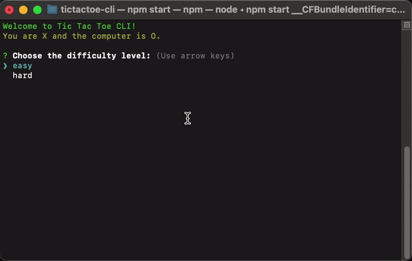

<a name="readme-top"></a>

<br />
<div align="center">
  <a href="https://www.npmjs.com/package/@ryan_dsilva/tictactoe">
    
    <!-- <a href="https://www.flaticon.com/free-icons/tic-tac-toe" title="tic tac toe icons">Tic tac toe icons created by Freepik - Flaticon</a> -->
  </a>

  <h3 align="center">TicTacToeCLI</h3>

  <p align="center">
    Tic Tac Toe, but in your terminal!
  </p>
</div>

<!-- ABOUT THE PROJECT -->

## About The Project


So, I was randomly thinking about games you can play in the terminal and had this lightbulb moment: why not make one myself? And what's easier to start with than good old Tic Tac Toe? Just for kicks, I decided to whip up this fun project on a lazy Sunday. Turned out to be a pretty cool way to spend the day!

On a more serious note, I did try to incorporate best practices and extensive documentation for my code. If you want to learn more about the AI algorithm I used, here's a great link that I used myself: [Link](https://www.youtube.com/watch?v=5y2a0Zhgq0U)

<p align="right">(<a href="#readme-top">back to top</a>)</p>

### Technologies and Platforms


<p align="right">(<a href="#readme-top">back to top</a>)</p>

<!-- GETTING STARTED -->

## Getting Started

### Prerequisites

Make sure you have Node.js installed and can access `npm`.

```sh
node -v

npm -v
```

### Installation

This project is intended to be installed globally through npm.

1. Install globally through NPM
   ```sh
   npm install -g @ryan_dsilva/tictactoe
   ```
2. Run using the shorthand, `ttt`
   ```sh
   ttt
   ```

<p align="right">(<a href="#readme-top">back to top</a>)</p>

<!-- USAGE -->

## Usage

Here's an example of me playing Tic Tac Toe in my terminal :smile:

<div align="center">
  
</div>


<p align="right">(<a href="#readme-top">back to top</a>)</p>

<!-- CONTACT -->

## Contact

[](https://ryandsilva.dev)
[](https://linkedin.com/in/ryan-dsilva)

<p align="right">(<a href="#readme-top">back to top</a>)</p>
